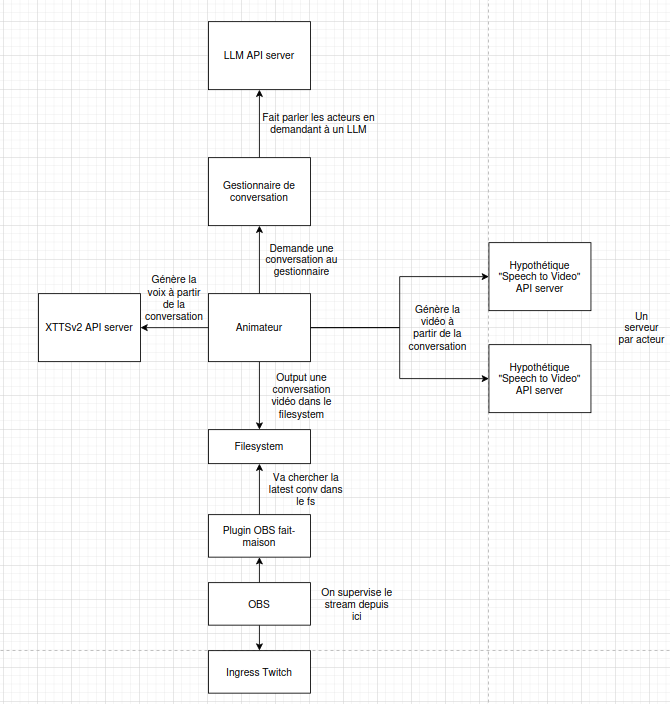

# DPaaS (Débat Politique as a Service)


Génération automatique, sur-demande, de débats politiques à l'aide de technologies d'intelligence artificielle (IA). Fonctionnalités:

- Imitation de voix

- Animation d'avatars virtuels

- Choix du sujet

Par défaut, les débats sont animés par Jean-Luc Mélenchon et Eric Zemmour, et sont au sujet des violences policières.

## Architecture

Les conversations sont générées en requêtant un LLM.

L'audio est généré à partir des complétions OpenAI par un webservice flask basé sur XTTSv2.

Les vidéos sont générées à partir d'images et de l'audio XTTSv2 par SadTalker.

Un serveur MariaDB est inclus pour authentifier les requêtes en utilisant un Bearer token.



## Pré-requis

Le système est assez complexe, mais si vous savez ce que vous faites vous devrez pouvoir l'étaler sur plusieurs machines ou pods k8s.

Le système est distribué par Docker pour faciliter les choses, mais peut fonctionner en standalone.

Assurez-vous d'avoir une carte graphique Nvidia capable d'inférer le modèle XTTSv2.

Ah, et, installez Docker (obviously)

## Installation

Une utilisation normale ne demande qu'à créer un fichier `.env` à la racine de ce dépôt avec les variables suivantes:

```
MYSQL_PASSWORD="..."
MYSQL_ROOT_PASSWORD="..."

LLM_TOKEN="..."
DPAAS_TOKEN_1="..."
DPAAS_TOKEN_2="..."

S3_ACCESS_KEY="..."
S3_SECRET_KEY="..."
```

Utilisez votre propre token OpenAI, ou bien un que vous avez générer avec Basaran/Llama-api si vous hébergez votre propre infération de modèle.

Le token Discord correspond à celui du bot. Chaque personnage doit avoit son propre bot Discord.

Se référer à la section suivante pour apprendre à générer des tokens DPAAS.

Vous pouvez maintenant construire les images Docker. Le premier build est lent car les modèles d'IA se font télécharger, mais les builds suivants seront plus rapides car le modèle sera en cache sur votre machine.

`$ docker compose build`

Vous pouvez à présent démarrer le stack de services. Le flag `-d` est utilisé pour les faire tourner en fond:

`$ docker compose up -d`

## Ajout d'un token DPAAS

Certains composants de DPaaS comme la génération par IA sont gourmands en ressources et bénéficient de fonctionner en bare-metal sur des machines dédiées sur un réseau local ou à distance. Dans le cas d'usage où les machines sont à distance, il est vital de protéger les services en authentifiant les requêtes avec un token pour éviter les attaques par déni de service. Cependant, l'authentification par token ne peut être efficace que lorsqu'associée à un tunnel chiffré, je recommande donc vivement de cacher les services derrière un reverse-proxy.

Générer un token:

`$ python3 -c 'import secrets; print(secrets.token_urlsafe(64));'`

Hash le token:

`$ python3 -c 'import hashlib; print(hashlib.sha256("YOUR_TOKEN".encode()).hexdigest());'`

Modifier `sql/init.sql` pour insérer le token dans la db:

`INSERT INTO tokens VALUES ('YOUR_HASH');`

Les tokens par défaut sont :

```
DPAAS_TOKEN_1="hvcyntF4SMqRCSXWGz5p-4H0vag9tvFyz2GXOTOXZ7XjLcsSaPbvrq2ziFxzDaMl"
DPAAS_TOKEN_2="utK9pJVPbDcinnxLw-qA-83Nct2BrzB255eQfLv5XytupEX8Q4ARw4gRhgAA8PF9"
```